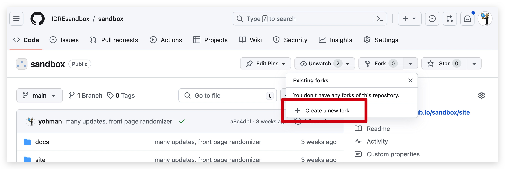
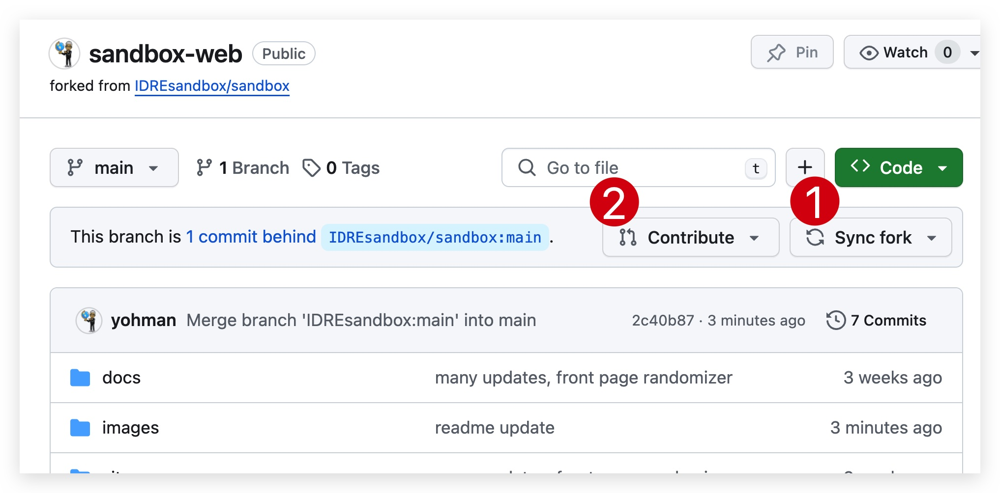

# Sandbox website

## Installation

This site is built using the [Material for MkDocs](https://squidfunk.github.io/mkdocs-material/getting-started/) framework. 

For contributors to this site, it is recommended for you to install MdDocs on your machine:

```
pip install mkdocs-material
```

Next, fork this repository to your GitHub account.



Clone the forked repository to your computer, and make local edits. Commit as necessary, and sync fork, then contribute when you are ready to publish. Make sure to resolve all conflicts along the way.



## Setting up your development environment

Launch terminal, and navigate to the folder where the clone for your forked repository resides. Enter the following command:

```
mkdocs serve
```

Open a browser and enter the provided local URL (such as http://127.0.0.1:8000/)

All front end edits should be made in the `docs` folder, which will automatically update the content. 

Once you are satisfied with your edits, build the site with the following command:

```
mkdocs build
```
This will update the content in the `site` folder, which is served to the public.

