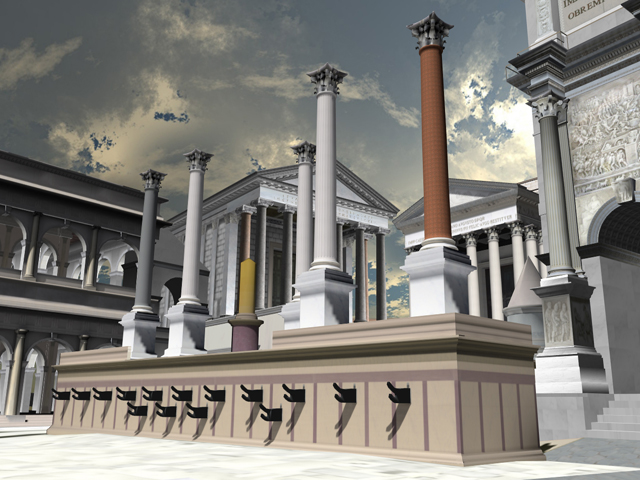

---
hide:
  - navigation
  - toc
---

	

		<a href="https://idre.ucla.edu/vsimvs">
			
			
VSim | Real-time exploration of highly detailed, three-dimensional computer models.

		</a>
	

	

		<a href="https://oarc.ucla.edu/about/our-team/francesca-albrezziF">
			
			
Digital Roman Forum | A digital model of the Roman Forum as it appeared in late antiquity.

		</a>
	

	

		<a href="https://my.matterport.com/show/?m=WNKBj4tkkVe">
			
			
Virtual Exhibition Tours | Myrlande Constant: The Work of Radiance

		</a>
	

	

		<a href="https://fowler.ucla.edu/art-africa-african-diaspora/">
			
			
 | Art of Africa and the African Diaspora

		</a>
	

 